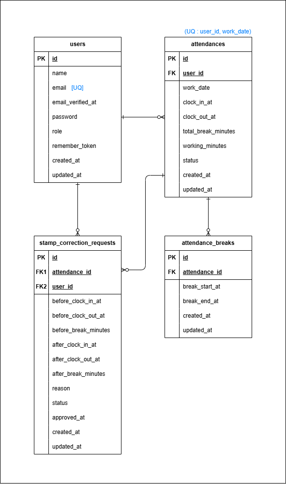

# 勤怠管理アプリ
本アプリケーションは、一般ユーザーによる勤怠打刻・勤怠履歴の確認および修正申請、管理者ユーザーによる勤怠管理・修正申請承認を行う勤怠管理システムです。

---

## 目次
1. 概要
2. 機能一覧
3. 使用技術
4. 環境構築手順
5. ログイン情報（必須）
6. 画面一覧
7. ER 図
8. テーブル一覧
9. テスト実行方法

---

## 1. 概要
本システムでは、以下の 2 種類のユーザーが利用できます。
- **一般ユーザー**：出勤／休憩／退勤の打刻、勤怠詳細の確認、修正申請の送信・確認
- **管理者ユーザー**：全ユーザーの勤怠確認、詳細修正、修正申請の承認

---

## 2. 機能一覧
### ▼ 一般ユーザー向け
- 会員登録 / ログイン / ログアウト
- 勤怠打刻（出勤・休憩・退勤）
- 勤怠ステータス表示（勤務外 / 出勤中 / 休憩中 / 退勤済）
- 勤怠一覧（月次）
- 勤怠詳細表示
- 勤怠修正申請（バリデーション含む）
- 修正申請一覧（承認待ち・承認済み）

### ▼ 管理者ユーザー向け
- 管理者ログイン / ログアウト
- 日次勤怠一覧表示（前日・翌日切替）
- 勤怠詳細表示
- 勤怠内容の直接修正
- 修正申請一覧表示（承認待ち・承認済み）
- 修正申請内容の承認処理
- スタッフ一覧表示
- スタッフ別月次勤怠一覧表示

---

## 3. 使用技術

- **PHP 8.2.29**
- **Laravel 12.40.2**
- **MySQL 8.0.44**
- **Nginx 1.21.1**
- **Docker / Docker Compose**
- **Mailhog**
- **Blade（テンプレートエンジン）**

---

## 4. 環境構築手順

### ① リポジトリをクローン
```bash
git clone https://github.com/mao716/attendance-app.git
cd attendance-app
```

### ② Docker コンテナの起動
```bash
docker compose up -d --build
```

### ③ パッケージインストール
```bash
docker compose exec php composer install
```

### ④ 環境変数ファイルの準備
```bash
cp .env.example .env
```
必要に応じて以下の DB 設定を確認：
```env
DB_CONNECTION=mysql
DB_HOST=mysql
DB_PORT=3306
DB_DATABASE=attendance_db
DB_USERNAME=attendance_user
DB_PASSWORD=attendance_pass
```

### ⑤ アプリケーションキー生成
```bash
docker compose exec php php artisan key:generate
```

### ⑥ マイグレーション・シーディング
```bash
docker compose exec php php artisan migrate
docker compose exec php php artisan db:seed
```

### ⑦ ブラウザで確認

以下の URL にアクセスしてください：`http://localhost`

---

## 5. ログイン情報（必須）

動作確認できるよう、以下のアカウントを用意しています。

### ▼ 管理者ユーザー（1名）

| メールアドレス        | パスワード     |
|------------------------|----------------|
| admin@example.com      | password123    |

### ▼ 一般ユーザー（5名）

| 名前       | メールアドレス         | パスワード     |
|------------|--------------------------|----------------|
| 佐藤 花子  | user1@example.com        | password123    |
| 鈴木 次郎  | user2@example.com        | password123    |
| 高橋 美咲  | user3@example.com        | password123    |
| 田中 大輝  | user4@example.com        | password123    |
| 山本 莉子  | user5@example.com        | password123    |

## 6. 画面一覧

| 画面ID | 画面名                           | パス                                      |
|--------|------------------------------------|--------------------------------------------|
| PG01   | 会員登録画面（一般）               | /register                                   |
| PG02   | ログイン画面（一般）               | /login                                      |
| PG03   | 勤怠登録画面                       | /attendance                                 |
| PG04   | 勤怠一覧画面                       | /attendance/list                            |
| PG05   | 勤怠詳細画面                       | /attendance/detail/{id}                     |
| PG06   | 修正申請一覧（一般）               | /stamp_correction_request/list              |
| PG07   | 管理者ログイン                     | /admin/login                                |
| PG08   | 日次勤怠一覧（管理者）             | /admin/attendance/list                      |
| PG09   | 日次勤怠詳細（管理者）             | /admin/attendance/{id}                      |
| PG10   | スタッフ一覧                       | /admin/staff/list                           |
| PG11   | スタッフ別月次勤怠一覧             | /admin/attendance/staff/{id}                |
| PG12   | 修正申請一覧（管理者）             | /stamp_correction_request/list              |
| PG13   | 修正申請承認画面                   | /stamp_correction_request/approve/{id}      |


## 7. ER 図



---

## 8. テーブル一覧

主要テーブル：

- users
- attendances
- attendance_breaks
- stamp_correction_requests

※ カラム定義・制約はテーブル仕様書に準拠。

---

## 9. テスト実行方法
以下のコマンドで PHPUnit テストを実行できます：
```bash
docker compose exec php php artisan test
```
